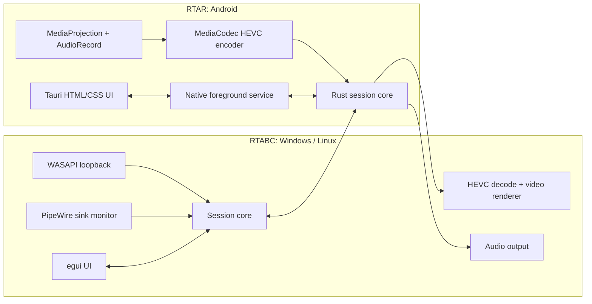
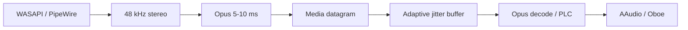
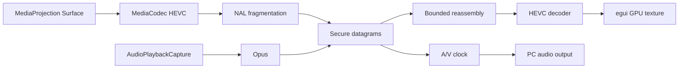

# Arquitectura

## Principios

1. El camino de medios no bloquea la UI.
2. Buffers tienen capacidad fija y política explícita de descarte.
3. Captura y reproducción dependen de interfaces por plataforma.
4. Negociación y estado son confiables; audio y video en vivo no se retransmiten tarde.
5. Android usa APIs nativas para lifecycle, captura y codec hardware. Rust mantiene protocolo, transporte y DSP portable.

## Componentes

## Escritorio

### Núcleo portable

- `SessionManager`: ciclo de vida y roles.
- `Transport`: discovery, pairing, control confiable y datagramas.
- `AudioSender` y `AudioReceiver`: Opus, jitter buffer, PLC, resampling y métricas.
- `VideoReceiver`: reensamblado HEVC, pérdida, solicitud de keyframe y reloj A/V.

### Adaptadores

- Windows audio capture: WASAPI loopback.
- Linux audio capture: PipeWire con captura del sink mediante `stream.capture.sink=true`.
- Audio output: CPAL mientras cumpla latencia; backend específico si una plataforma lo exige.
- HEVC decode: decoder nativo/hardware cuando esté disponible, con libavcodec como fallback empaquetado y revisado legalmente.
- Render: textura GPU integrada en el viewport de `egui`.

Todo uso de `windows` queda bajo `cfg(target_os = "windows")`. La compilación Linux no enlaza COM, `winres` ni APIs de Windows.

## Android

Tauri conserva UI y comandos. Las operaciones que Android debe considerar prioritarias viven en un módulo nativo Kotlin:

- `PlaybackForegroundService`: mantiene recepción y reproducción con pantalla apagada.
- `ProjectionForegroundService`: posee `MediaProjection`, `VirtualDisplay`, `AudioRecord` y encoder `MediaCodec`.
- Puente JNI/Tauri: envía comandos de lifecycle y superficies; no transporta cada frame por JavaScript.
- Rust core: red, framing, reensamblado, Opus y métricas.

No se conservarán objetos CPAL mediante punteros globales manuales. El propietario será una estructura de sesión con `Drop`, cancelación y `JoinHandle` controlados.

## Audio PC a Android

## Pantalla y audio Android a PC

## Transporte por etapas

- Stage 1 usa UDP existente con envelope binario v1.
- Transporte objetivo usa QUIC DATAGRAM para medios y stream confiable para negociación, métricas, keyframe y control. Ofrece autenticación y cifrado sin retransmitir medios tardíos.
- Discovery se limita a LAN. El emparejamiento muestra código o confirmación en ambos extremos.
- Cada sesión tiene identificador aleatorio y streams separados.

## Política de buffers

- Captura: ring buffer fijo. Si productor supera consumidor, descartar lo más antiguo y marcar discontinuidad.
- Audio receptor: objetivo adaptativo dentro de límites configurados; jamás crece sin límite.
- Video: máximo dos frames incompletos por stream. Al vencer deadline, descartar frame completo.
- Render: un frame listo y uno en decode. La UI nunca forma una cola de frames históricos.

## Sincronización

Audio es reloj principal. Timestamps representan instante de captura en microsegundos monotónicos del emisor. La negociación intercambia muestras de reloj para estimar offset. Video adelantado espera dentro del presupuesto; video atrasado se descarta.
